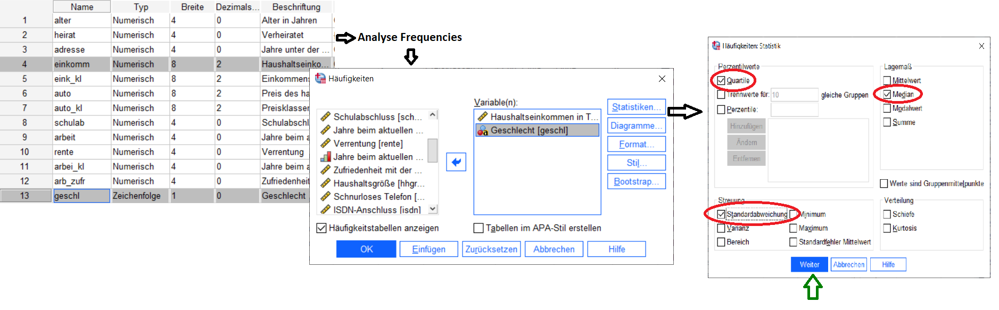
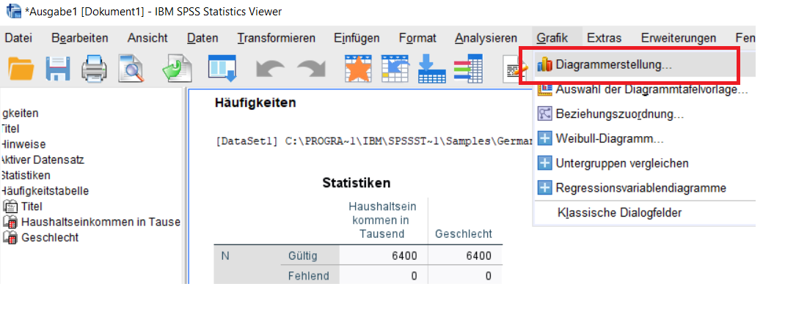
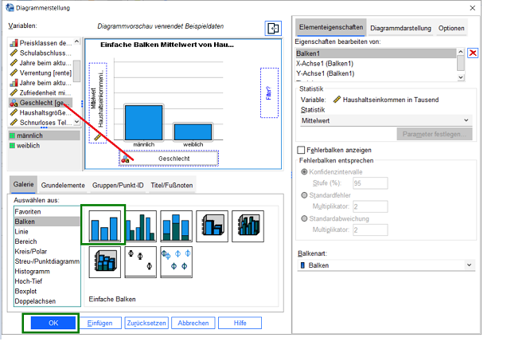
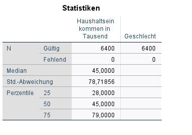
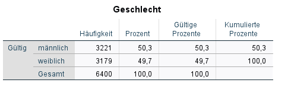
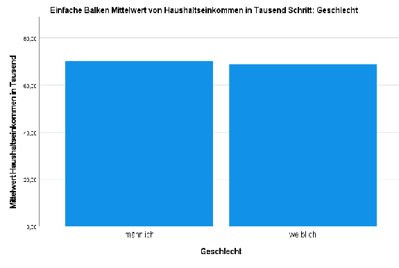

**Coursera--Big-Data-Emerging-Technologies** 

<u>***Project 1:***</u>

https://www.ibm.com/docs/de/spss-statistics/SaaS?topic=tutorial-introduction

Load demo.sav and make some simple evaluations, eg. frequency distribution of income versus gender. Print out the results and graphics:

Pressing the Green arrowed button, gives you the result. Now we want to add some graphics. In the output windows, we select "Diagrams":

We select a simple bar graph, drag and drop the variables income and gender:

After pressing OK, we have the result.

**... (to long for printing)**

and the graphics

