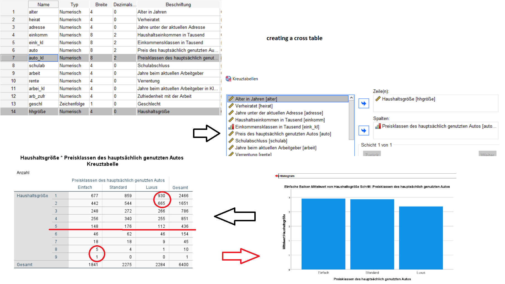
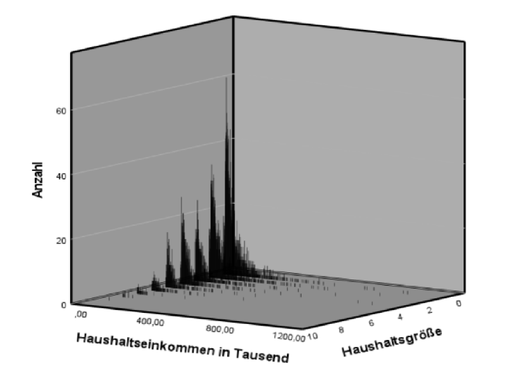
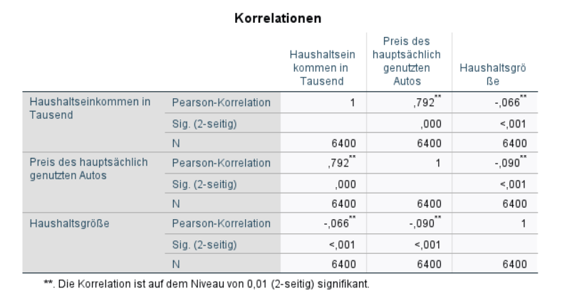
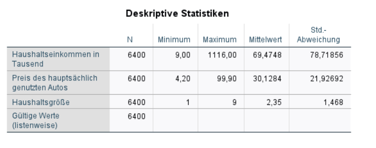

**Coursera--Big-Data-Emerging-Technologies** 

<u>***Project 1:***</u>

https://www.ibm.com/docs/de/spss-statistics/SaaS?topic=tutorial-introduction

Load demo.sav and make some simple evaluations, eg. frequency distribution of income versus gender. Print out the results and graphics:

Pressing the Green arrowed button, gives you the result. Now we want to add some graphics. In the output windows, we select "Diagrams":

We select a simple bar graph, drag and drop the variables income and gender:

After pressing OK, we have the result.

**... (to long for printing)**

and the graphics

<u>***Project 2:***</u>

Statistics of Number of people in household (reside) and the Primary vehicle price category (carcat). Evaluating a cross table with histogram:

As we see, the correlation is straight forward. Standard and luxury cars dominate in households with few people. It is a social impact that children-rich households belong to the poorer part of the society.

This is shown in the comparison ‘Number of people in household’ and the ‘Household income in thousands'

This graph shows the correlation of income related to household size of this sample.

The correlation results in 

This means the average of a two person household is a standard car priced with 30k$ and an average annual income of 70k$.
